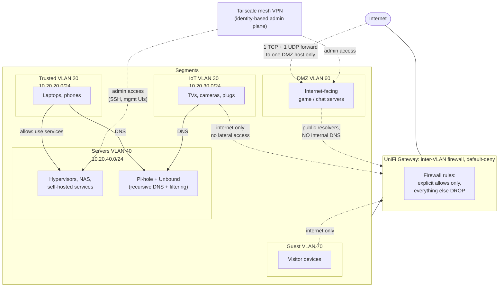

# Segmenting a Home Network Like a Corporate One: VLANs, Default-Deny Firewall Rules, and DNS as a Security Control

Rebuilding a flat consumer home network into a segmented one: six VLANs on UniFi hardware, **default-deny firewall rules between segments**, a DMZ for anything internet-facing, and a self-hosted DNS layer (Pi-hole + Unbound) that acts as both a privacy boundary and a filtering control.

> **Note on this repo:** This is a sanitized, public write-up of the network I actually run. Subnets, addresses, and hostnames below are placeholders (`10.20.x.0/24`, `your-domain.com`); the segmentation policy, the firewall rules, and the reasoning are real. That's also why the git history is a single squashed commit: the write-up was sanitized from a private working copy before publishing.

---

## Problem

The network started the way most do: one consumer router, one `/24`, and every device on it. That's fine when "every device" is two laptops. It stops being fine when the same broadcast domain contains:

- **Personal devices:** laptops and phones with email, banking, and password managers on them.
- **IoT devices:** smart TVs, cameras, plugs, and bulbs running vendor firmware that may never see a security update. Most of it phones home to clouds I don't control.
- **Servers**, meaning a virtualization cluster and a NAS holding years of family photos and documents, plus a dozen self-hosted services.
- **Internet-facing services:** game and chat servers that, by definition, accept traffic from strangers.

On a flat network, all of these are one hop from each other. The practical consequences:

- **A compromised IoT device is on the same segment as the NAS.** A smart bulb with 2019-era firmware should never be able to *reach* the hypervisor's management page, but on a flat network it can.
- **An internet-facing service is a beachhead.** If the public game server gets popped, the attacker isn't in some contained pocket. They're inside the house, next to everything.
- **Zero visibility or control at the DNS layer.** Every device resolved names through the ISP's resolver; I couldn't see what was being looked up, block what shouldn't be, or keep that query history away from a third party.
- **No structural defense, just device-by-device hope.** The security of the whole network was the security of its least-patched device.

This is exactly the problem enterprise networks solve with segmentation, and the goal was to apply the same discipline at home: **assume any single device can be compromised, and make sure that compromise is contained by the network itself rather than by luck.**

---

## What I Built

I replaced the consumer router with UniFi gear (gateway, managed PoE switch, access points) and carved the network into six VLANs with **default-deny firewall policy between them**. Segments can only talk where a rule I consciously wrote says they can.

### The segments

| VLAN | Purpose | Trust level |
|---|---|---|
| **Management** | Network gear itself (gateway, switch, APs) | Highest; reachable only from Trusted |
| **Trusted** | Personal laptops, phones | High |
| **Servers** | Hypervisor cluster, NAS, self-hosted services | High, but *not* trusted by default from elsewhere |
| **IoT** | TVs, cameras, plugs, assistants | Low: internet only, no lateral access |
| **DMZ** | Internet-facing services (game/chat servers) | Lowest, assumed compromised |
| **Guest** | Visitors' devices | Untrusted: internet only, isolated |

### The controls

- **Default-deny between segments.** Inter-VLAN traffic is blocked unless an explicit allow rule exists. The allows are few, narrow, and directional: Trusted can *initiate* to Servers (to use the services); nothing initiates *into* Trusted; IoT and Guest get internet only; **nothing inside the network can initiate into the DMZ, and the DMZ can initiate into nothing.** The full traffic matrix is in [`docs/segmentation-policy.md`](docs/segmentation-policy.md).
- **DNS as a control plane.** A Pi-hole handles DNS for the internal segments, with **Unbound behind it doing full recursive resolution**: queries go to the DNS root servers directly, so no upstream provider accumulates the household's lookup history. Pi-hole's blocklists filter ads, trackers, and known-malicious domains *for every device at once*, including the IoT gear that offers no settings of its own. Config example in [`pihole/unbound.example.conf`](pihole/unbound.example.conf).
- **The DMZ deliberately does NOT use internal DNS.** Internet-facing hosts resolve through public resolvers. A DMZ box has no business making requests into the server segment, not even for DNS. If it's compromised, it learns nothing about the internal network's names.
- **Minimal, justified inbound exposure.** Web-facing services are published through **outbound-only tunnels**, so no inbound port is needed at all (see my [Nextcloud + Cloudflare Tunnel repo](https://github.com/brockharries/nextcloud-cloudflare-tunnel)). The only true port-forwards are for one realtime-media workload that genuinely needs UDP: one TCP port and one UDP port, to one DMZ host, and nothing else.
- **A separate admin plane.** Administration (SSH, hypervisor UI, switch management) happens over a **Tailscale mesh VPN with identity-based access**, not over inter-VLAN allow rules. This matters because of the key decision below.

### Architecture



Every arrow that *isn't* drawn is the point: IoT cannot reach Servers, Guest cannot reach anything internal, nothing internal can initiate into the DMZ, and the DMZ can initiate into nothing at all.

### What's in this repo

```
vlan-segmented-network-security/
├── README.md                          # this file
├── docs/
│   └── segmentation-policy.md         # the full traffic matrix + the reasoning per rule
├── unifi/
│   └── firewall-rules.example.md      # sanitized inter-VLAN rule set as configured
└── pihole/
    └── unbound.example.conf           # recursive resolver config behind Pi-hole
```

---

## Key Decision & Why

**The decision: default-deny between all segments, including against myself. The admin path runs over an identity-based VPN, not over firewall exceptions.**

The tempting version of home-network segmentation is "block the scary stuff, allow the convenient stuff": deny IoT, but let the trusted and server segments talk freely to everything, because that's where *I* work. I chose the stricter model, and it's the decision I'd defend in a design review:

**1. Default-deny is the only policy you can audit at a glance.** With default-allow-plus-blocks, the security posture is "everything I remembered to block." With default-deny, it's "exactly the rules on this one page, and nothing else." When I want to know whether the IoT segment can reach the NAS, I don't have to reason about rule interactions. I look for an allow rule, and if it isn't there, the answer is no. Controls you can verify by reading beat controls you have to simulate.

**2. Segmentation you exempt yourself from isn't segmentation.** The DMZ is the segment most likely to be compromised; it's the one taking traffic from the internet. The single most valuable rule in the whole set is *"nothing initiates into the DMZ, the DMZ initiates into nothing."* An allow rule from the server segment into the DMZ "just for admin" would have quietly broken that: a DMZ compromise could then be answered by anything the admin path exposed. Instead, admin access rides the Tailscale mesh, authenticated by identity and device rather than by which subnet the packet came from.

**3. The inconvenience is the control working.** This design costs me friction, and I felt it: mid-deployment of a new DMZ service, I couldn't reach it from my server segment *by my own rule*, and had to route admin access properly (over the mesh) instead of punching a hole. That moment is the feature. A rule that never inconveniences anyone is usually a rule that isn't constraining anything.

**4. DNS is a boundary, not just a service.** Running Unbound as a full recursive resolver means the household's DNS history isn't a product in someone else's analytics pipeline, and Pi-hole gives one enforcement point for every device, including the lightbulbs that will never get a settings page. Keeping the DMZ *off* internal DNS is the same thinking in reverse: name resolution is reconnaissance, and a compromised public host doesn't get to do reconnaissance on my internal namespace.

**The cost of this decision, so it's on the record:** this is more moving parts and more ways to confuse myself. A misfiled device gets the wrong VLAN and "the internet is broken," and at least once the firewall was the "bug" I spent an evening debugging. Self-hosted DNS also means DNS is now *my* uptime problem. For a network I administer alone, the containment is worth the friction. For a household of non-technical users with no admin on call, I'd simplify (fewer segments, more managed components), and being able to say *where* that line sits is the actual skill.

---

## What I'd Do Differently at Scale

This protects a house. Standing the same design up for an organization, the changes are specific and nameable:

**Identity-based network access, not SSID/port-based.** At home, a device lands in a VLAN because of which SSID it joined or which switch port it's on. At scale that becomes **802.1X/NAC with RADIUS**: the network authenticates the device and *assigns* it to a segment, instead of trusting the plug it happened to use.

**Microsegmentation over subnet segmentation.** VLANs contain segments; they don't contain what happens *inside* one. Two servers on the server VLAN can still reach each other freely. In production I'd push policy down to the workload level (per-service firewall policy, or a zero-trust overlay where every flow is authenticated) so "Servers" stops being one implicit trust zone.

**Central logging and detection.** The gateway's built-in IDS/IPS and per-rule logging is a start; at scale, flow logs and DNS logs ship to a SIEM with alerting on the interesting denials. The *attempt* (IoT device probing the server segment) is the signal, and today I'd only see it if I went looking.

**Redundant DNS.** One Pi-hole is a single point of failure for name resolution on every internal segment. At home that's an annoyance; in an office it's an outage. At scale: a redundant resolver pair, health-checked, with the same blocklist policy applied to both.

**Policy as code.** The firewall rule set lives in a GUI. At scale it should live in version control, reviewed, diffed, and deployed like any other change, so "who allowed IoT to reach that host, and when?" is a `git log` answer instead of an archaeology project.

**A written exception process.** At home, the exception process is me arguing with myself. In an organization, the default-deny posture only survives if there's a lightweight, documented way to request, justify, time-box, and *revisit* an allow rule. Otherwise the first urgent deadline punches the hole that never closes.

The backbone stays the same: segments with default-deny between them, DNS as a control point, identity for admin access. The rest is what it takes for that backbone to survive contact with more people than one.

---

## Why I built this (in one line)

Network segmentation, DNS filtering, and firewall policy are things I'd otherwise only get to talk about. This way, when a customer asks why their flat network is a risk or what default-deny actually costs day-to-day, I'm answering from a network I run, not a diagram I read.
